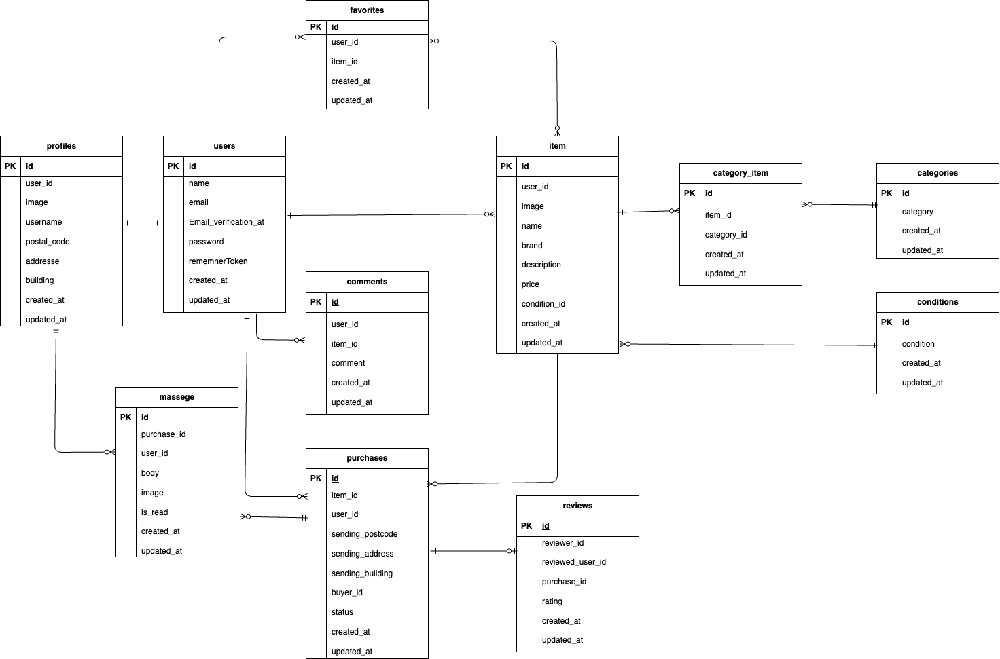

# flea_market_app

## 環境構築
**Dockerビルド**
1. `git clone git@github.com:aiko217/flea_market_app.git`
2. cd flea_market_app
3. DockerDesktopアプリを立ち上げる
4. `docker-compose up -d --build`

**Laravel環境構築**
1. `docker-compose exec php bash`
2. `composer install`
3. 「.env.example」ファイルを 「.env」ファイルに命名を変更。または、新しく.envファイルを作成
4. .envに以下の環境変数を追加
``` text
DB_CONNECTION=mysql
DB_HOST=mysql
DB_PORT=3306
DB_DATABASE=laravel_db
DB_USERNAME=laravel_user
DB_PASSWORD=laravel_pass
```
5. アプリケーションキーの作成
``` bash
php artisan key:generate
```

6. マイグレーションの実行
``` bash
php artisan migrate
```

7. シーディングの実行
``` bash
php artisan db:seed
```
8. シンボリックリンク作成
``` bash
php artisan storage:link
```
## テスト　（PHPUnit）

###　概要
このプロジェクトでは Laravel 標準の PHPUnit を使用してテストを実施しています。
テスト用のデータベースや環境設定を `.env.testing` に定義し、実行時には `--env=testing` を指定します。

### テスト環境のセットアップ
1. `.env` をコピーして `.env.testing` を作成します。
   ```bash
   cp .env .env.testing
   ```
   ``` bash
   2. php artisan key:generate --env=testing
   3. php artisan config:clear
   4. php artisan migrate --env=testing
   5. php artisan make:test HelloTest
   6. vendor/bin/phpunit tests/Feature/HelloTest.php
   ```
### 実行結果
   ``` bash
  PHPUnit 9.5.20 #StandWithUkraine

  .                                                         1 / 1 (100%)

  Time: 00:00.573, Memory: 26.00 MB

  OK (1 test, 1 assertion)
   ```

## メール認証

mailhogというツールを使用しています。<br>
以下のリンクから会員登録をしてください。　<br>
http://localhost:8025/

1. .envに以下の環境変数を追加
``` text
MAIL_MAILER=smtp
MAIL_HOST=mailhog
MAIL_PORT=1025
MAIL_FROM_ADDRESS=no-reply@example.com
MAIL_FROM_NAME="${APP_NAME}"
```

## user のログイン用初期データ

name: 出品者A 
email: seller1@example.com 
password: password  
-------------------------
name: 出品者B
email: seller2@example.com
password: password  
-------------------------
name: 未出品ユーザー
email: nouser@example.com
password: password
-------------------------

## 使用技術(実行環境)
- PHP8.1.33
- Laravel 8.83.8
- MySQL8.0

- ## URL
- 開発環境：http://localhost/
- phpMyAdmin:：http://localhost:8080/

## ER 図



### usersテーブル	
   |カラム名 | 型 | primary key | unique key | not null | foreign key |					
	|id | bigint |	○	|	○	|
	|name	| varchar(255)	|		| ○	|
	|email | varchar(255) |		○	|
	|Email Verification_at	| timestamp |				
	|password |varchar(255)	|		○	|
	|rememberToken	|varchar(100)	|			
	|created_at	|timestamp |			
	|updated_at	|timestamp |
											
### itemsテーブル	
   |カラム名 | 型 | primary key | unique key | not null | foreign key |						
	|id | bigint |	○	|	○	|
	|user_id	| bigint	| 	○	| users(id) |
	|image | varchar(255) |	○	|
	|name	| varchar(255)	| 	○	|
	|brand |	varchar(255) |			
	|description | varchar(255) |	○	|
	|price |	int |	 ○	|
	|condition_id	| bigint	|	○	| conditions_(id) |
	|created_at	| timestamp	|	○	|
	|updated_at	| timestamp	| 	○	|
   						
### purchasesテーブル	
   |カラム名 | 型 | primary key | unique key | not null | foreign key |						
	|id |bigint	| ○ |	 ○	|
	|item_id	| bigint	|	○	|tems(id) |
	|buyer_id | bigint |	○	| users(id) |
	|sending_postcode	| varchar(255)	|	○	|
	|sending_address	| varchar(255)	| 	○	|
	|sending_building	| varchar(255)	|			
	|status	| varchar(255)	|			
	|updated_at	| timestamp	|			
	|created_at	| timestamp	|			
	                 				
### profilesテーブル	
   |カラム名 | 型 | primary key | unique key | not null | foreign key |					
	|id | bigint	| ○	|	○	|
	|user_id	| bigint	| 	○	|users(id) |
	|image |	varchar(255) |			
	|username | varchar(255) |	○	|
	|postal_code |	string |	○	|
	|address	| varchar(255)	|	○	|
	|building | varchar(255) |			
	|created_at	| timestamp	|			
	|updated_at	| timestamp	|			
													
### favoritesテーブル
   |カラム名 | 型 | primary key | unique key | not null | foreign key |						
	|id | bigint |	○	|	○	|
	|user_id	| bigint	| ○ | users(id) |
	|item_id	| bigint	|	○	| item(id)|
	|created_at	| timestamp	|			
	|updated_at	| timestamp	|			
					
### categoriesテーブル	
   |カラム名 | 型 | primary key | unique key | not null | foreign key |					
	|id |bigint	| ○ |	○	|
	|category |	varchar(255) |	○	|
	|created_at	| timestamp	|		
	|updated_at	| timestamp	|
							
### category_item	
   |カラム名 | 型 | primary key | unique key | not null | foreign key |					
	|id | bigint |	○	|	○	|
	|item_id	| bigint	|	○	| users(id)|
	|category_id | bigint |	○	| categories(id) |
	|created_at	| timestamp	|			
	|updated_at	| timestamp	|		
																	
### commentsテーブル	
   |カラム名 | 型 | primary key | unique key | not null | foreign key |					
	|id	| bigint	| ○	|	○	|
	|user_id	bigint |	○	| users(id) |
	|item_id	bigint	|	○	|
	|comment |	varchar(255) |	○	|
	|created_at	| timestamp	|		
	|updated_at	| timestamp	|		
													
### conditionsテーブル
   |カラム名 | 型 | primary key | unique key | not null | foreign key |						
	|id	| bigint |	○ |	○	|
	|condition	| varchar(255)	|	○	|
	|created_at	timestamp |			
	|updated_at	timestamp |			
																		
### messagesテーブル	
   |カラム名 | 型 | primary key | unique key | not null | foreign key |					
	|id | bigint |	○	|	○	|
	|purchase_id |	bigint |			○	
	|user_id	| bigint	|			
	|body |	varchar(255)	|			
	|image |	varchar(255)	|			
	|is_read	| varchar(255)	|			
	|created_at	| timestamp	|			
	|updated_at	| timestamp	|			
	   											
### reviewsテーブル	
   |カラム名 | 型 | primary key | unique key | not null | foreign key |					
	|id |	bigint |	○	|	○	|
	|reviewer_id	| bigint	|		○	|
	|reviewed_user_id	| bigint	|		
	|created_at	| timestamp	|			
	|updated_at	| timestamp	|			
	|rating	|varchar(255)	|			
	|purchase_id |	bigint	|			
						
						
						
						
						
						