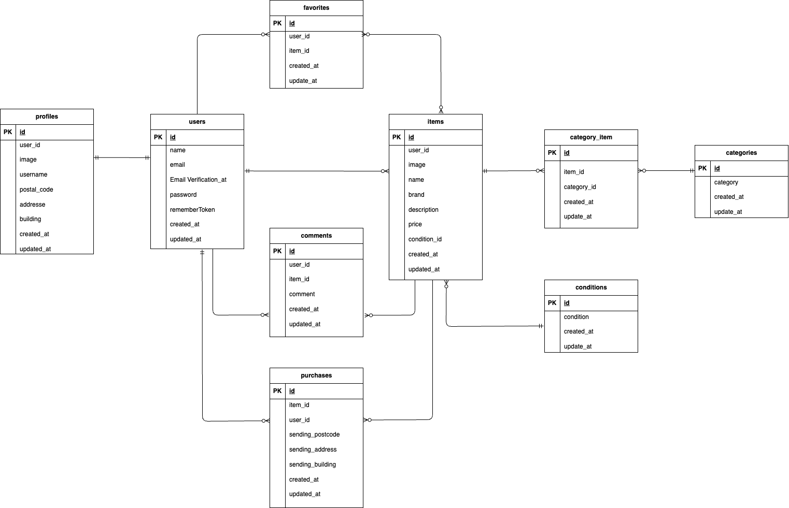

# flea_market_app

## 環境構築
**Dockerビルド**
1. `git clone git@github.com:aiko217/flea_market_app.git`
2. cd flea_market_app
3. DockerDesktopアプリを立ち上げる
4. `docker-compose up -d --build`

**Laravel環境構築**
1. `docker-compose exec php bash`
2. `composer install`
3. 「.env.example」ファイルを 「.env」ファイルに命名を変更。または、新しく.envファイルを作成
4. .envに以下の環境変数を追加
``` text
DB_CONNECTION=mysql
DB_HOST=mysql
DB_PORT=3306
DB_DATABASE=laravel_db
DB_USERNAME=laravel_user
DB_PASSWORD=laravel_pass
```
5. アプリケーションキーの作成
``` bash
php artisan key:generate
```

6. マイグレーションの実行
``` bash
php artisan migrate
```

7. シーディングの実行
``` bash
php artisan db:seed
```
8. シンボリックリンク作成
``` bash
php artisan storage:link
```
## テスト　（PHPUnit）

###　概要
このプロジェクトでは Laravel 標準の PHPUnit を使用してテストを実施しています。
テスト用のデータベースや環境設定を `.env.testing` に定義し、実行時には `--env=testing` を指定します。

### テスト環境のセットアップ
1. `.env` をコピーして `.env.testing` を作成します。
   ```bash
   cp .env .env.testing
   ```
   ``` bash
   2. php artisan key:generate --env=testing
   3. php artisan config:clear
   4. php artisan migrate --env=testing
   5. php artisan make:test HelloTest
   6. vendor/bin/phpunit tests/Feature/HelloTest.php
   ```
### 実行結果
   ``` bash
  PHPUnit 9.5.20 #StandWithUkraine

  .                                                         1 / 1 (100%)

  Time: 00:00.573, Memory: 26.00 MB

  OK (1 test, 1 assertion)
   ```

## user のログイン用初期データ

- メールアドレス: user@gmail.com
- パスワード: user1234

## 使用技術(実行環境)
- PHP8.1.33
- Laravel 8.83.8
- MySQL8.0

- ## URL
- 開発環境：http://localhost/
- phpMyAdmin:：http://localhost:8080/

## ER 図

